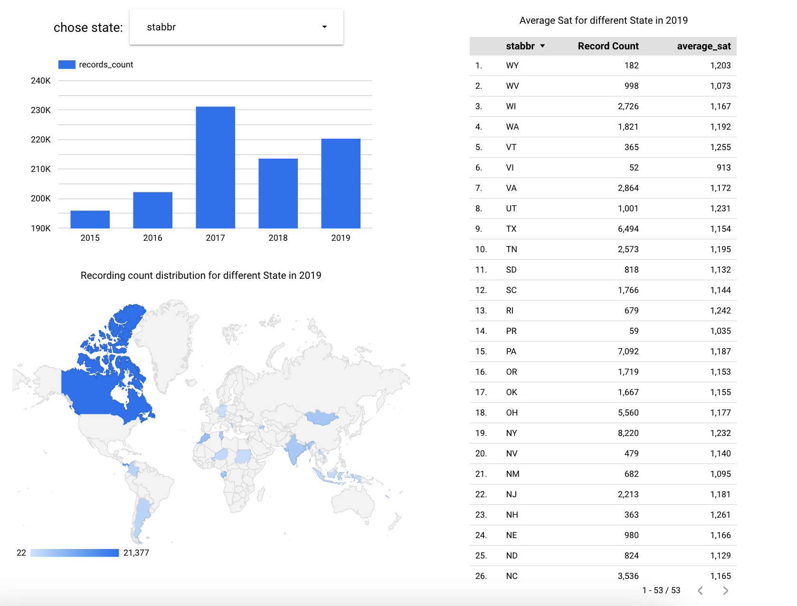
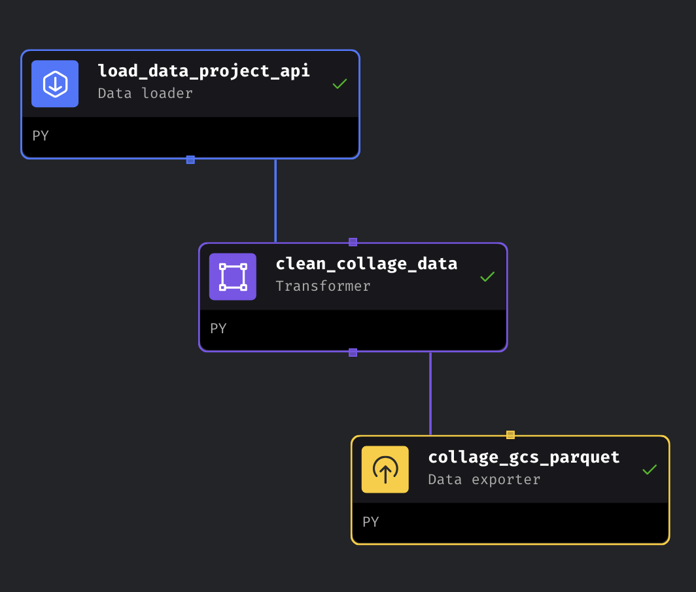
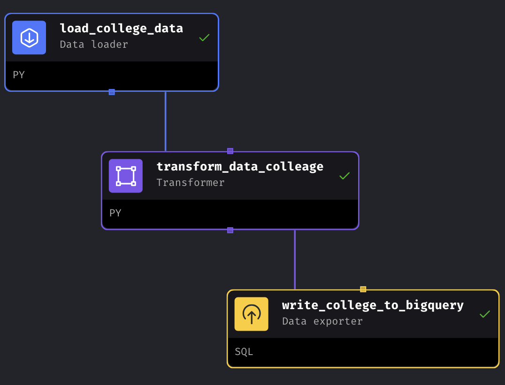

# Data Engineering Zoomcamp Project


## Index
- [Data Engineering Zoomcamp Project](#data-engineering-zoomcamp-project)
  - [Index](#index)
- [Problem Description](#problem-description)
- [Dataset](#dataset)
- [Dashboard](#dashboard)
- [Code Structure](#code-structure)
- [Project details and implementation](#project-details-and-implementation)
- [Reproduce the project](#reproduce-the-project)
  - [Prerequisites](#prerequisites)
  - [Running the Code](#running-the-code)

# Problem Description

This is a Data Engineering project that downloads data from the [U.S.Department of Education College Scorecard](https://collegescorecard.ed.gov/data/documentation/). This project allows us to gain educational insights into the educational recordings(like the SAT scores, degree type description etc.) and distributions from different states. We can compare the SAT scores across different states and explore trends from 2015 to 2019. The original dataset contains extensive records for each institution. However, numerous "Null" and "Privacy Suppressed" entries complicate data exploration and the retrieval of key information, especially concerning the admission characteristics of different institutions in various states.


# Dataset

The chosen dataset for this project is the [U.S.Department of Education College Scorecard zip file](https://ed-public-download.app.cloud.gov/downloads/CollegeScorecard_Raw_Data_09262023.zip). 

```
├── data.yaml
├── Crosswalks
│ ├── CW2000.xlsx
│ ├── ......
├── Most-Recent-Cohorts-Field-of-Study.csv
├── Most-Recent-Cohorts-Institution.csv
├── FieldOfStudyData1415_1516_PP.csv
├── FieldOfStudyData1516_1617_PP.csv
├── FieldOfStudyData1617_1718_PP.csv
├── FieldOfStudyData1718_1819_PP.csv
├── FieldOfStudyData1819_1920_PP.csv
├── MERGED2001_02_PP.csv 
├── ......
└── MERGED2021_22_PP.csv

```

For this project, I mainly chose `FieldOfStudyData1415_1516_PP.csv`, `FieldOfStudyData1516_1617_PP.csv`,
`FieldOfStudyData1617_1718_PP.csv`
`FieldOfStudyData1819_1920_PP.csv` and 
`MERGED2019_20_PP.csv` to process data. From the `data.yml` from the original dataset, `MERGED2019_20_PP.csv`  and `FieldOfStudyData1819_1920_PP.csv` files are records of 2019 year. Moreover, through the field of study data, we can figure out the amount of data records distribution on each states from 2015-2019. 
# Dashboard

You may access the dashboard with the visualizations [in this link](https://lookerstudio.google.com/reporting/4ef9a84a-fc0a-4579-8a58-66957f5674ec).

Here is a small screeshot of the Dashboard.

Using the dropdown button, you can select the target state; the bar chart then displays the trend in recording counts for the selected state from 2015 to 2019.

Simultaneously, the geo chart shows that the recordings in 2019, are distributed unevenly across different states. The table indirectly provides the average SAT scores for various colleges in different states.

# Code Structure 

```
├── requirement.txt
├── dashboard_code
├── data_schema
├── dbt
├── gcp_datawarehouse
├── mage-zoomcamp
├── image
├── terraform_project
├── dashboard_code
└── ReadME.md
```

# Project details and implementation

This project mainly utilize Google Cloud Platform, Big Query and Cloud storage.

Cloud infrastructure is mostly managed with Terraform. Details in reproduce the code.

Data ingestion is through Mage. Before data ingestion, to obatin the data schema, I utilized the `project/data_schema/upload_data_get_schema.ipynb` through connecting to the postgre(command in services file).

Through the `project_pipeline_datalake` 
pipeline, the DAG transforms csv file into parquet and upload to bucket. 

Through the `project_pipeline_data_warehouse` pipeline, the DAG transforms csv file into parquet and upload to bucket. 
,
Then in the [big query](gcp_datawarehouse/project_query_merge.sql), the data is partitioned by `st_fips`(FIPS code for state). The reason why I chose `st_fips` is I compared `st_fips` with other variables, as the data does not contain datetime, so Integer should be chosen. When exploring the length of slot millisecond and size of byte process with different variables, the `st_fips` is the best one, with 1.52 KB byte processing, 0 sec duration and 197 Slot milliseconds. The number of partition variables is larger, the time will be shorter and byte processing will be smaller. Then, I chose `unitid` as cluster for the similar reason.

dbt is also utilized for creating the transformations to build visualizations(Model and Materialized view in the dbt folder).

Moreover, there are two tables in order to visualize the data. Building one time-series figure durning 2015-2019, the recording count of different states changes as time. Another one is to get the SAT scores for different states in 2019.

# Reproduce the project

# Prerequisites

The following requirements are required:

1. Build [Google Cloud Platform](https://cloud.google.com/) service account.
    - Navigate to the GCP Console and create a new project. Give the project name and copy the project ID.
2. Create a service account:
   - Click "IAM & Admin" and then chose "Service accounts".
   - Click "Create service account" button.
   - Enter a name for your service account.
   - Select the roles you want to grant to the service account. 
    For this project, the following roles are necessary:    
        - BigQuery Admin
        - Storage Admin
        - Compute Admin Roles
   - Click "Create" to create the service account.
   - After you've created the service account, the private key file(usually JSON file) should be safely saved and download.
   - For this project, rename it to `creds.json`.
3. [Docker](https://docs.docker.com/engine/install/)
4. [Git](https://git-scm.com/book/en/v2/Getting-Started-Installing-Git)
5. [Terraform](https://developer.hashicorp.com/terraform/install)
6. [Mage AI](https://github.com/mage-ai/mage-zoomcamp/tree/master)

# Running the Code


1. Git clone this repository
```sh
git clone https://github.com/20chen-7/College-data-dashboard.git
```
2. Create key folder and save the sevice account private key(my-creds.json) into terraform/key folder and mage-zoomcamp directories.
```sh
cd terraform_project/
mkdir key
```
3. Return to the project directory then setup terraform
```sh
terraform init
```
4. Adjustify your local region or your dataset/project name then:
```sh
terraform plan
```
5. Create or update infrastructure:
```sh
terraform apply
```
6. Destroy the created infrastructure:
```sh
terraform destroy
```
**IMPORTANT**: We only use this command when you finished with the whole project.
7. Prepare the dataset into mage/de-bootcamp-final-project/dataset and run `download_data_parquet.ipynb`
```sh
cd ../dataset_prepare
```
8. Move the mage directory
```sh
cd ../mage
```
9. Rename `dev.env` to `.env`.
```sh
mv dev.env .env
```
10. Now, let's build the container
```sh
docker compose build
```
```sh
docker compose up
```
11. Pipeline under the name `magic-zoomcamp`. Then, navigate to http://localhost:6789 in your browser! 
  - Click to `project_pipeline_datalake` data pipeline.
    (replace the file name for the data loader and explorer, we will upload the parquet files into gcb. )
  - Click to `project_pipeline_datalake_merge` data pipeline to upload `MERGED2019_20_PP.parquet`.
  - Click to `project_pipeline_data_warehouse` data pipeline and run then we will get the `study_data_xx` for diverse years.
  **IMPORTANT**: `FieldOfStudyData1819_1920_PP.csv` file is the recording in 2019 based on the data.yml on the website(source website). So I renamed it `studydata_19`. Similarly, `MERGED2019_20_PP.parquet` in the dataset,is renamed as `mergedata_19`.
12. copy `dashboard_table/data_visual_project_time.sql` to build `state_yearly_record_counts` table, preparing for data dashboard visualization.

## Setting up dbt Cloud
```sh
dbt build
```
```sh
dbt run --vars '{'is_test_run': 'false'}'
```
dbt accomplishment check in branch `20chen-7-patch-1`.
13. To visualize the time-seres, we can copy `gcp_datawarehouse/project_query_merge.sql` and create table accordingly. Then use the Google looker studio and find the table through ranging the states and years.
    